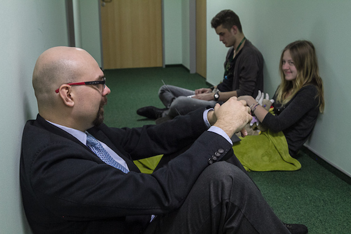

24-29 Jan 2016 I had a workshop for gifted high-school students of the [Polish Children's Fund](https://en.wikipedia.org/wiki/Polish_Children%27s_Fund) ([Krajowy Fundusz na rzecz Dzieci](http://fundusz.org/)) entitled _Interactive Data Visualization_. It was a part of workshops in practical computer science, at [ICM, University of Warsaw](http://www.icm.edu.pl/web/guest), organized by [@bolikowski](https://twitter.com/bolikowski).

My intent was to show data visualization so they can start with getting data, and end up with a publicly-accessible data visualization.

Monday morning was for lectures introducing to the topics (others were: _Image Analysis_ and _Clustering of Languages_). Monday afternoon to Thursday evening - work of students, with some guidance. Friday morning - presentation of their results.

I had 5 participants (3 girls, 2 boys), who had background mostly in algorithms, with C++ as their primary language.

## Materials

- Slides: [Interaktywna wizualizacja danych w d3.js](https://speakerdeck.com/pmigdal/interaktywna-wizualizacja-danych-w-d3-dot-js) (in Polish... but mostly pictures)
- Motivational examples: [Simpson Paradox](http://vudlab.com/simpsons/), [Nutrient Contents – Parallel Coordinates](http://exposedata.com/parallel/), [Immersion](https://immersion.media.mit.edu/demo), [How Americans Die](http://www.bloomberg.com/dataview/2014-04-17/how-americans-die.html), [Explained Visually](http://setosa.io/ev/)
- General data visualization
  - [Data looks better naked](http://darkhorseanalytics.com/blog/data-looks-better-naked)
  - [7 reasons you should use dot graphs](http://www.maartenlambrechts.be/to-the-point-7-reasons-you-should-use-dot-graphs)
  - [Meaning + Beauty in Data Vis and Data Art](http://lisacharlotterost.github.io/2015/12/19/Meaning-and-Beauty-in-Data-Vis/) - _Data vis should be as pretty as possible but not prettier_
  - [Edward Tufte, The Visual Display of Quantitative Information](http://www.edwardtufte.com/tufte/books_vdqi) - a classic book
  - [Willard C. Brinton, Graphic presentation](https://archive.org/stream/graphicpresentat00brinrich#page/n0/mode/thumb) - a book (1939), freely accessible on archive.org
- JavaScript
  - [Learn X in Y minutes, where X=JavaScript](https://learnxinyminutes.com/docs/javascript/) (telling that they should skip part about prototypes); mostly syntax, but it was enough
  - [MDN JavaScript](https://developer.mozilla.org/en-US/docs/Web/JavaScript) - as a reference
  - [Eloquent JavaScript](http://eloquentjavascript.net/) - a thing that I typically recommend for learning JavaScript and programming (but didn't use it in this case)
- [D3.js](https://d3js.org/) intro
  - [D3 Intro by Vadim Ogievetsky](http://vadim.ogievetsky.com/IntroD3/)
  - [my exercise 1 at Plunker](http://plnkr.co/edit/mt0Ubc?p=preview)
  - [D3 example gallery](https://github.com/mbostock/d3/wiki/Gallery)
  - [bl.ocks.org/mbostock](http://bl.ocks.org/mbostock), e.g. [Bar Chart I](http://bl.ocks.org/mbostock/7322386), [Multitouch Drag](http://bl.ocks.org/mbostock/9631744), [Force Sticky Layout](http://bl.ocks.org/mbostock/3750558), [Cluster Force Layout IV](http://bl.ocks.org/mbostock/7882658)
- D3.js - additional tutorial and references
  - [dashingd3js.com](http://dashingd3js.com/)
  - [d3noob.org](http://www.d3noob.org/)
  - [alignedleft.com/tutorials/d3](http://alignedleft.com/tutorials/d3/)
  - [christopheviau.com/d3_tutorial](http://christopheviau.com/d3_tutorial/)
- D3.js - specific aspects
  - [d3 categorical colors & Google colors](http://bl.ocks.org/aaizemberg/78bd3dade9593896a59d) - use nice colors, not e.g. `#00ff00` or `yellow`
  - [Modifying Graph Parameters](http://dhs.stanford.edu/dh/networks/)
  - [Notes on coincidence graphs and community detection in JS](https://github.com/stared/tagoverflow#methods-and-tricks)
- My links with overview (in Polish)
  - [Wizualizujemy Wikipedię](http://warsztatywww.wikidot.com/www10:wizualizujemy-wikipedie) - at [Wakacyjne Warsztaty Wielodyscyplinarne](http://warsztatywww.wikidot.com/en:indie-camp-for-hs-geeks)
  - [Sztuka robienia wykresów](https://github.com/DELabUW/szkola-letnia-2015/blob/master/zajecia/deser_sztuka_robienia_wykresow.ipynb) - at [github.com/DELabUW/szkola-letnia-2015](https://github.com/DELabUW/szkola-letnia-2015)
  - [Metawstęp do wizualizacji danych w d3.js](http://smarterpoland.pl/index.php/2014/06/metawstep-do-wizualizacji-danych-w-d3-js/)
- My projects (selected)
  - [TagOverflow](http://p.migdal.pl/tagoverflow/) - coincidence of tags from the Stack Exchange network
  - [Map of KFnrD fellows and their interests, years 1997-2013](http://p.migdal.pl/kfnrd_viz/mapa.html)
- [Hackpad](https://hackpad.com/) for sharing links (to materials, data, projects, solutions to their particular projects). I find it more convenient that sending emails over and over (especially as 2 boys joined it the second day) and for plain text is is better than Google Docs (clear indication who added which line; no font size/style)
- Setting local server (`$ python2 -m SimpleHTTPServer` then open http://localhost:8000)
- Git - for version control
  - [Try Git](https://try.github.io/) for learning how it works and in general GitHub help
  - [GitHub Pages](https://pages.github.com/) for publishing their visualizations
- Habit of looking up code on websites with visualizations (hopefully).
- I should have shown:
  - [Searchable D3.js Gallery (2490 examples!)](http://christopheviau.com/d3list/gallery.html)
  - [The Fallen of World War 2](http://www.fallen.io/ww2/)
  - [Bootstrap](http://getbootstrap.com/)
  - [reddit.com/r/dataisbeautiful](https://www.reddit.com/r/dataisbeautiful)

## Fruits

Maybe the most important - what were their projects?

- Julia Bazińska, [Influences of Philosophers - as of Wikipedia ](http://lamyiowce.github.io/philosophers-wiki/)
- Anna Urbala, [Star Wars Actors](http://floydwarshall.github.io/star_wars_actors/)
- Zuzanna Opała, [Jobs on Stack Overflow](https://zuuja.github.io/Jobs-on-Stack-Visualisation/)
- Dominik Kufel, [Bible Cross-Reference Visualization](https://dom98.github.io/Bible-Books-interconnections-visualization-using-d3.js/)

## Comments

I was extremely happy with the participants. I knew in advance that they were not "normal students", but still - got impressed by their motivation to learn, and that each of them made a project in this short timespan.
Moreover, they self-learned and applied quite a few things I hadn't shown.
I was not sure if starting with JavaScript syntax was enough. But it turned about that (as they knew C++), it was fine - and I think a good trade-off, given the time constraints.

I had a few data pieces in mind, but let them to choose their topic. It introduced some initial chaos, but I wanted to makes sure they have data they like and they are able to pick a sensible dataset.

Some projects required data wrangling, which they did in C++, C# and Perl. I was tempted to show Python but it was not enough time. I only showed [one Python script (Jupyter Notebook) to scrape Stack Overflow Jobs data](https://github.com/stared/Jobs-on-Stack-Visualisation/blob/master/careers%20data%20downloading.ipynb) and explained it step by step.

Force-directed graph is a black hole - once I showed it, all of the participants wanted to use it.
I have mixed feelings about it - I love them (TagOverflow, Themes of Polish Books, etc), but it is more high-level than the core D3.js API. And projects were not as diverse as they might have been.

