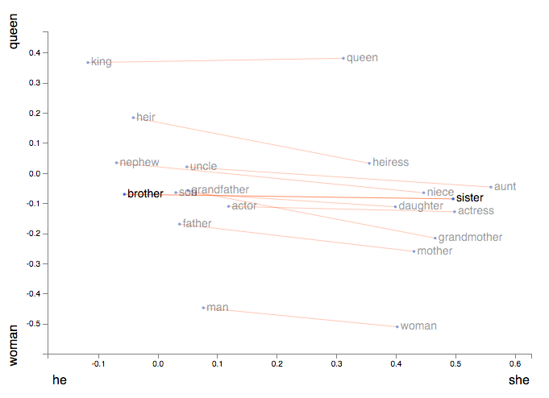
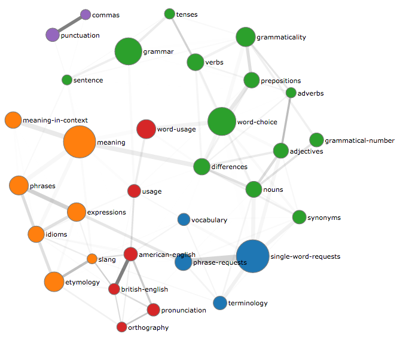
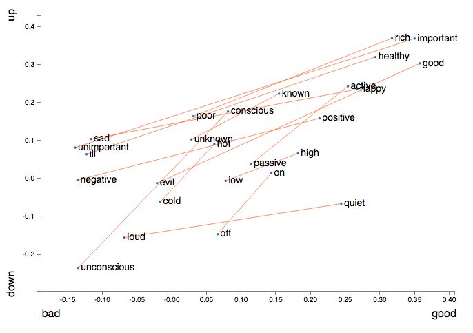
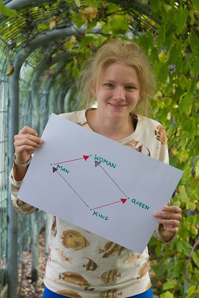

## Intro

**word2vec** is an algorithm that transforms words into vectors, so that words with similar meaning end up laying close to each other. Moreover, it allows us to use vector arithmetics to work with analogies, for example the famous `king - man + woman = queen`.

I will try to explain how it works, with special emphasis on the meaning of vector differences, at the same time omitting as many technicalities as possible.

If you would rather explore than read, here is an interactive exploration by my mentee Julia Bazińska, now a freshman of computer science at the University of Warsaw:

- [Word2viz](https://lamyiowce.github.io/word2viz/) by using [GloVe](http://nlp.stanford.edu/projects/glove/) pre-trained vectors (it takes 30MB to load - please be patient)

## Counts, coincidences and meaning

> I love letter co-occurrence in the word _co-occurrence_.

Sometimes a seemingly naive technique gives powerful results. It turns out that merely looking at word coincidences, while ignoring all grammar and context, can provide us insight into the meaning of a word.
Consider this sentence:

> A small, fluffy roosety climbed a tree.

What's a _roosety_? I would say that something like a squirrel, since the two words can be easily interchanged. Such reasoning is called the [distributional hypothesis](https://en.wikipedia.org/wiki/Distributional_semantics) and can be summarized as:

> a word is characterized by the company it keeps - [John Rupert Firth](https://en.wikipedia.org/wiki/John_Rupert_Firth)

If we want to teach it to a computer, the simplest, approximated approach is making it look only at word pairs.
Let _P(a|b)_ be the conditional probability that given a word _b_ there is a word _a_ within a short distance (let's say - being spaced by no more that 2 words).
Then we claim that two words _a_ and _b_ are similar if

$$ P(w|a) = P(w|b) $$

for every word _w_.
In other words, if we have this equality, no matter if there is word _a_ or _b_, all other words occur with the same frequency.

Even simple word counts, compared by source, can give interesting results, e.g. that in lyrics of metal songs words (_cries_, _eternity_ or _ashes_ are popular, while words _particularly_ or _approximately_ are not, well, particularly common), see [Heavy Metal and Natural Language Processing](http://www.degeneratestate.org/posts/2016/Apr/20/heavy-metal-and-natural-language-processing-part-1/).
See also [Gender Roles with Text Mining and N-grams](http://juliasilge.com/blog/Gender-Pronouns/) by Julia Silge.

Looking at co-occurrences can provide much more information. For example, one of my projects, [TagOverflow](http://p.migdal.pl/tagoverflow/), gives insight into structure of programming, based only on the usage of [tags on Stack Overflow](http://stackoverflow.com/tags).
It also shows that I am in love with pointwise mutual information, which brings us to the next point.

## Pointwise mutual information and compression

> The Compressors: View cognition as compression. Compressed sensing, approximate matrix factorization - [The (n) Cultures of Machine Learning - HN discussion](https://news.ycombinator.com/item?id=10954508)

In principle, we can compute _P(a|b)_ for every word pair.
But even with a small dictionary of 100 000 words (bear in mind that we need to keep all declinations, proper names and things which are not in official dictionaries, yet are in use) keeping track of all pairs would require 8 gigabytes of space.

Often instead of working with conditional probabilities, we use the [pointwise mutual information](https://en.wikipedia.org/wiki/Pointwise_mutual_information) (PMI), defined as:

$$ PMI(a, b) = \log \left[ \frac{P(a,b)}{P(a)P(b)} \right] = \log \left[ \frac{P(a|b)}{P(a)} \right].$$

Its direct interpretation is how much more likely we get a pair than if it were [at random](<https://en.wikipedia.org/wiki/Independence_(probability_theory)>).
The logarithm makes it easier to work with [words appearing at frequencies](https://en.wiktionary.org/wiki/Wiktionary:Frequency_lists/) of different orders of magnitude.
We can approximate PMI as a scalar product:

$$ PMI(a, b) = \vec{v}_a \cdot \vec{v}_b, $$

where $$\vec{v}_i$$ are vectors, typically of 50-300 dimensions.

At the first glance it may be strange that all words can be compressed to a space of much smaller dimensionality. But there are words that can be trivially interchanged (e.g. _John_ to _Peter_) and there is a lot of structure in general.

The fact that this compression is lossy may give it an advantage, as it can discover patterns rather than only memorize each pair.
For example, in recommendation systems for movie ratings, each rating is approximated by a scalar product of two vectors - a movie's content and a user's preference. This is used to predict scores for as yet unseen movies, see [Matrix Factorization with TensorFlow - Katherine Bailey](http://katbailey.github.io/post/matrix-factorization-with-tensorflow/).

## Word similarity and vector closeness

> Stock Market ≈ Thermometer - [Five crazy abstractions my word2vec model just did](http://byterot.blogspot.com/2015/06/five-crazy-abstractions-my-deep-learning-word2doc-model-just-did-NLP-gensim.html)

Let us start with the simple stuff - showing word similarity in a vector space.
The condition that $$P(w \vert a)=P(w \vert b)$$ is equivalent to

$$ PMI(w, a) = PMI(w, b), $$

by dividing both sides by _P(w)_ and taking their logarithms.
After expressing PMI with vector products, we get

$$ \vec{v}_w \cdot \vec{v}_a = \vec{v}_w \cdot \vec{v}_b $$

$$ \vec{v}_w \cdot \left( \vec{v}_a - \vec{v}_b \right) = 0 $$

If it needs to work for every $$ \vec{v}_w $$, then

$$ \vec{v}_a = \vec{v}_b. $$

Of course, in every practical case we won't get an exact equality, just words being close to each other. Words close in this space are often synonyms (e.g. _happy_ and _delighted_), antonyms (e.g. _good_ and _evil_) or other easily interchangeable words (e.g. _yellow_ and _blue_).
In particular most of [opposing ideas](https://en.wikipedia.org/wiki/Horseshoe_theory) (e.g. _religion_ and _atheism_) will have similar context. If you want to play with that, look at this [word2sense phrase search](https://demos.explosion.ai/sense2vec/?word=machine%20learning&sense=auto).

What I find much more interesting is that words form a linear space. In particular, a zero vector represent a totally uncharacteristic word, occurring with every other word at the random chance level (as its scalar product with every word is zero, so is its PMI).

It is one of the reasons why for vector similarity people often use cosine distance, i.e.

$$ \frac{\vec{v}_a \cdot \vec{v}_b}{\vert \vec{v}_a \vert \vert \vec{v}_b \vert}. $$

That is, it puts emphasis on the direction in which a given word co-occurs with other words, rather than the strength of this effect.

## Analogies and linear space

If we want to make word analogies (_a is to b is as A is to B_), one may argue that in can be expressed as an equality of conditional probability ratios

$$ \frac{P(w|a)}{P(w|b)} = \frac{P(w|A)}{P(w|B)} $$

for every word _w_. Sure, it looks (and is!) a questionable assumption, but it is still the best thing we can do with conditional probability. I will not try defending this formulation - I will show its equivalent formulations.

For example, if we want to say _dog is to puppy as cat is to kitten_, we expect that if e.g. word _nice_ co-occurs with both _dog_ and _cat_ (likely with different frequencies), then it co-occurs with _puppy_ and _kitten_ by the same factor.
It appears it is true, with the factor of two favoring the cubs - compare [pairs](https://books.google.com/ngrams/graph?content=nice+cat%2Cnice+kitten%2Cnice+dog%2Cnice+puppy&year_start=1960&year_end=2008&corpus=0&smoothing=5&share=&direct_url=t1%3B%2Cnice%20cat%3B%2Cc0%3B.t1%3B%2Cnice%20kitten%3B%2Cc0%3B.t1%3B%2Cnice%20dog%3B%2Cc0%3B.t1%3B%2Cnice%20puppy%3B%2Cc0) to [words](https://books.google.com/ngrams/graph?content=cat%2Ckitten%2Cdog%2Cpuppy&year_start=1960&year_end=2008&corpus=0&smoothing=5&share=&direct_url=t1%3B%2Ccat%3B%2Cc0%3B.t1%3B%2Ckitten%3B%2Cc0%3B.t1%3B%2Cdog%3B%2Cc0%3B.t1%3B%2Cpuppy%3B%2Cc0) from [Google Books Ngram Viewer](https://books.google.com/ngrams) (while n-grams look only at adjacent words, they can be some sort of approximation).

By proposing ratios for word analogies we implicitly assume that the probabilities of words can be factorized with respect to different dimensions of a word. For the discussed case it would be:

$$
P(w\vert dog) = f(w\vert species=dog) \times f(w\vert age=adult) \times P(w\vert is\_a\_pet) \\
P(w\vert puppy) = f(w\vert species=dog) \times f(w\vert age=cub) \times P(w\vert is\_a\_pet) \\
P(w\vert cat) = f(w\vert species=cat) \times f(w\vert age=adult) \times P(w\vert is\_a\_pet) \\
P(w\vert kitten) = f(w\vert species=cat) \times f(w\vert age=cub) \times P(w\vert is\_a\_pet) $$

So, in particular:
$$

How does the equality of conditional probability ratios translate to the word vectors?
If we express it as mutual information (again, _P(w)_ and logarithms) we get

$$ \vec{v}_w \cdot \vec{v}_a - \vec{v}_w \cdot \vec{v}_b = \vec{v}_w \cdot \vec{v}_A - \vec{v}_w \cdot \vec{v}_B, $$

which is the same as

$$ \vec{v}_w \cdot \left( \vec{v}_a - \vec{v}_b - \vec{v}_A + \vec{v}_B \right) = 0.$$

Again, if we want it to hold for any word _w_, this vector difference needs to be zero.

We can use analogies for meaning (e.g. changing gender with vectors), grammar (e.g. changing tenses) or other analogies (e.g. cities into their zip codes).
It seems that analogies are not only a computational trick - we may actually use them to think all the time, see:

- George Lakoff, Mark Johnson, [Metaphors We Live By](https://www.amazon.com/Metaphors-We-Live-George-Lakoff/dp/0226468011) (1980)
- and [their list of conceptual metaphors in English (webarchive)](http://web.archive.org/web/20080718021721/http://cogsci.berkeley.edu/lakoff/metaphors/), in particular look for _X is Up_, plotted below:

## Differences and projections

> `woman - man = female - male = she - he`, so `wo = fe = s` (a joke)

Difference of words vectors, like

$$ \vec{v}_{she} - \vec{v}_{he} $$

are not words vectors by themselves.
However, it is interesting to project a word on this axis.
We can see that the projection

$$
= \log\left[ P(w|a) \right] - \log\left[ P(w|b) \right]$$

is exactly a relative occurrence of a word within different contexts.

Bear in mind that when we want to look at common aspects of a word it is more natural to average two vectors rather than take their sum. While people use it interchangeably, it only works because cosine distance ignores the absolute vector length. So, for a gender neutral pronoun use $$ (\vec{v}_{she} + \vec{v}_{he})/2 $$ rather than their sum.

Just looking at the word co-locations can give interesting results, look at these artistic projects - [Word Spectrum](http://www.chrisharrison.net/index.php/Visualizations/WordSpectrum) and [Word Associations](http://www.chrisharrison.net/index.php/Visualizations/WordAssociations) from Visualizing Google's Bi-Gram Data by [Chris Harrison](http://www.chrisharrison.net/).

## I want to play!

If you want **explore**, there is [Word2viz](https://lamyiowce.github.io/word2viz/) by Julia Bazińska.
You can choose between one of several pre-defined plots, or create one from scratch (choosing words and projections).
I've just realized that Google Research released a tool for that as well:
[Open sourcing the Embedding Projector: a tool for visualizing high dimensional data - Google Research blog](https://research.googleblog.com/2016/12/open-sourcing-embedding-projector-tool.html) (and the actual live demo: [Embedding Projector](http://projector.tensorflow.org/)).

If you want to use **pre-trained vectors**, see [Stanford GloVe](http://nlp.stanford.edu/projects/glove/) or [Google word2vec](https://code.google.com/archive/p/word2vec/) download sections.
Some examples in Jupyter Notebooks are in our playground [github.com/lamyiowce/word2viz](https://github.com/lamyiowce/word2viz) (warning: raw state, look at them at your own risk).

If you want to train it on your **own dataset**, use a Python library [gensim: Topic modelling for humans](https://radimrehurek.com/gensim/).
Often some preprocessing is needed, especially look at [Sense2vec with spaCy and Gensim](https://explosion.ai/blog/sense2vec-with-spacy) by Matthew Honnibal.

If you want to create it **from scratch**, the most convenient way is to start with [Vector Representations of Words - TensorFlow Tutorial](https://www.tensorflow.org/versions/r0.11/tutorials/word2vec/index.html) (see also a respective [Jupyter Notebook from Udacity Course](https://github.com/tensorflow/tensorflow/blob/master/tensorflow/examples/udacity/5_word2vec.ipynb)).

If you want to **learn** how it works, I recommend the following materials:

* [A Word is Worth a Thousand Vectors](http://multithreaded.stitchfix.com/blog/2015/03/11/word-is-worth-a-thousand-vectors/) by Chris Moody
* Daniel Jurafsky, James H. Martin, [Speech and Language Processing](https://web.stanford.edu/~jurafsky/slp3/) (2015):
  * [Chapter 15: Vector Semantics](https://web.stanford.edu/~jurafsky/slp3/15.pdf) (and [slides](https://web.stanford.edu/~jurafsky/slp3/slides/vector1.pdf))
  * [Chapter 16: Semantics with Dense Vectors](https://web.stanford.edu/~jurafsky/slp3/16.pdf) (and [slides](https://web.stanford.edu/~jurafsky/slp3/slides/vector2.pdf))
* [Distributional approaches to word meanings](http://web.stanford.edu/class/linguist236/materials/ling236-handout-05-09-vsm.pdf) from [Seminar: Representations of Meaning course at Stanford by Noah D. Goodman and Christopher Potts](http://web.stanford.edu/class/linguist236/)
* [GloVe: Global Vectors for Word Representation](http://nlp.stanford.edu/projects/glove/) and paper
  * Jeffrey Pennington, Richard Socher, Christopher D. Manning, [GloVe: Global Vectors for Word Representation](http://nlp.stanford.edu/pubs/glove.pdf) (2014)
  * it's great, except for its claims for greatness, see: [GloVe vs word2vec](https://rare-technologies.com/making-sense-of-word2vec) by Radim Rehurek
* [On Chomsky and the Two Cultures of Statistical Learning](http://norvig.com/chomsky.html) by Peter Norvig

> Julia Bazińska, at the rooftop garden of the [Warsaw University Library](https://en.wikipedia.org/wiki/Warsaw_University_Library) - the building in which we worked

## Technicalities

I tried to give some insight into algorithms transforming words into vectors. Every practical approach needs a bit more tweaking. Here are a few clarifications:

* word2vec is not a single task or algorithm; popular ones are:
  * Skip-Gram Negative-Sampling (implicit compression of PMI),
  * Skip-Gram Noise-Contrastive Training (implicit compression of conditional probability),
  * GloVe (explicit compression of co-occurrences),
* while *word* and *context* are essentially the same thing (both are words), they are being probed and treated differently (to account for different word frequencies),
* there are two sets of vectors (each word has two vectors, one for word and the other - for context),
* as any practical dataset of occurrences would contain PMI $$-\infty$$ for some pairs, in most cases positive pointwise mutual information (PPMI) is being used instead,
* often pre-processing is needed (e.g. to catch phrases like *machine learning* or to distinguish words with two separate meanings),
* linear space of meaning is a disputed concept,
* all results are a function of the data we used to feed our algorithm, not objective truth; so it is easy to get stereotypes like `doctor - man + woman = nurse`.

For further reading I recommend:

* [How does word2vec work?](https://www.quora.com/How-does-word2vec-work) by Omer Levy
* Omer Levy, Yoav Goldberg, [Neural Word Embeddings as Implicit Matrix Factorization](https://levyomer.files.wordpress.com/2014/09/neural-word-embeddings-as-implicit-matrix-factorization.pdf), NIPS 2014
* with a caveat: [Skipgram isn’t Matrix Factorisation](http://building-babylon.net/2016/05/12/skipgram-isnt-matrix-factorisation/) by Benjamin Wilson
* [Language bias and black sheep](http://nlpers.blogspot.ie/2016/06/language-bias-and-black-sheep.html)
* [Language necessarily contains human biases, and so will machines trained on language corpora](https://freedom-to-tinker.com/2016/08/24/language-necessarily-contains-human-biases-and-so-will-machines-trained-on-language-corpora/) by Arvind Narayanan
* [Word Embeddings: Explaining their properties](http://www.offconvex.org/2016/02/14/word-embeddings-2/) - on word analogies by Sanjeev Arora
* Tal Linzen, [Issues in evaluating semantic spaces using word analogies](https://arxiv.org/abs/1606.07736), arXiv:1606.07736
* **EDIT** (Feb 2018): Alex Gittens, Dimitris Achlioptas, Michael W. Mahoney, [Skip-Gram – Zipf + Uniform = Vector Additivity](http://www.aclweb.org/anthology/P/P17/P17-1007.pdf)

## Some backstory

I got interested in word2vec and related techniques for my general interest in machine learning and for my general appreciations of:

* matrix factorization,
* pointwise mutual information,
* conceptual metaphors,
* simple techniques mimicking human cognition.

I had an motivation to learn more on the subject as I was tutoring Julia Bazińska during a two-week summer internship at [DELab, University of Warsaw](http://www.delab.uw.edu.pl/), supported by the Polish Children's Fund. See also my blog posts:

* [Helping exceptionally gifted children in Poland](http://crastina.se/gifted-children-in-poland-by-piotr-migdal/) - on the Polish Children's Fund
* [D3.js workshop at ICM for KFnrD](http://p.migdal.pl/2016/02/09/d3js-icm-kfnrd.html) in Jan 2016, where it all started

## Thanks

This draft benefited from feedback from [Grzegorz Uriasz](https://github.com/grzegorz225/) (what's simple and what isn't), [Sarah Martin](http://goodsexlifestyle.com/) (readability and grammar remarks). I want to especially thank [Levy Omer](https://levyomer.wordpress.com/) for pointing to weak points (and shady assumptions) of word vector arithmetics.

## EDIT

It got some popularity, including ~20k views in the first day, and being tweeted by [the authors of GloVe at Stanford](https://twitter.com/stanfordnlp/status/818881718077661184) and [Kaggle](https://twitter.com/kaggle/status/819258895235424258).

Though, what I like the most is to see how people interact with it:

* [artistic-scientific impulsive-analytical](https://twitter.com/cesifoti/status/818672972743450624) by Cesar Hidalgo from MIT Media Lab
* [good-evil unlawful-lawful and AD&D classes](http://imgur.com/3FzX81i) from HN comment thread :)
$$
