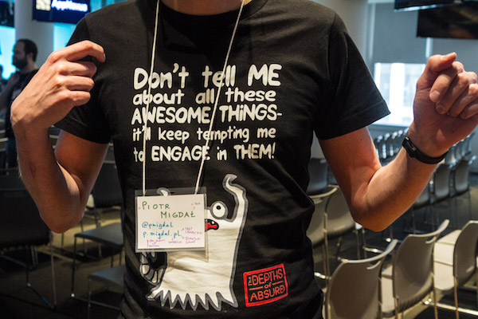
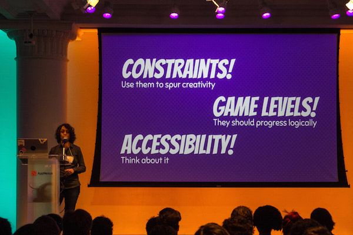
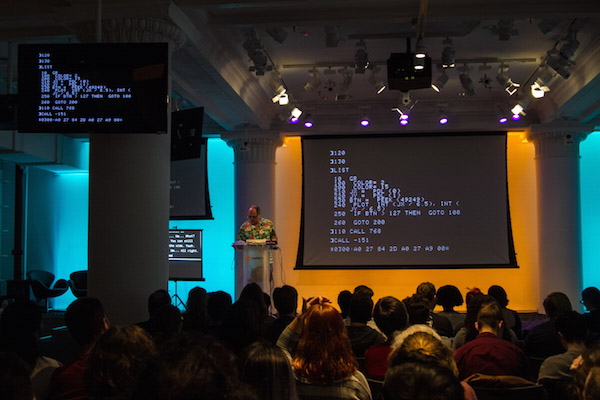

Widespread uproar about the Googler's memo[^google] gave me the impulse to make a small email excavation and write about an awesome experience of inclusivity I had at one conference.
Crucial components were:

- inclusive-inclusivity (i.e. reasonable accommodation for many traits)
- no shaming for unintended slips

> Like in the best geek camps in my life I could feel myself and express it without fear of being judged. Though, it it was way more open for geeks, nerds, queer folk, neurotypicals and all other good-willed and curious creatures.

A few months ago I participated in [!!con](http://bangbangcon.com/) (6-7 May 2017, New York), a bottom-up conference based on 10 min talks on any topic related to programming (or: [experiencing computing viscerally](http://composition.al/blog/2016/08/31/experiencing-computing-viscerally-my-pg-podcast-interview-about-bangbangcon/).
It was organized by [Recurse Center (formerly: Hacker School)](https://www.recurse.com/) alumni, including its most prolific blogger, [Julia Evans](https://jvns.ca/). There were about [30 talks](http://bangbangcon.com/speakers.html) and 200 participants. Ticket disappeared 14 min after opening registration. And for my taste there wasn't single bad talk and ~50% were awesome.

I went there exactly between [Open Data Science Conference](https://www.odsc.com/training/portfolio/neptune-one-platform-rule-manage-monitor-data-science-experiments) in Boston and [GPU Technology Conference](http://www.gputechconf.com/) in San Jose. It was a stretch, but totally worth it!

I write this post partly to give praise to organizers (and fellow participants!), but mostly to spread ideas worth re-using in other events - about openness to participants, topics, etc.

A lot of it comes from [Recurse Center ethos](https://www.recurse.com/manual), see the section [Social Rules](https://www.recurse.com/manual#sub-sec-social-rules), especially:

- No subtle -isms
- No feigning surprise

[](https://xkcd.com/1053/)

## Registration

I applied to give a talk. It wasn't selected, but I received the best rejection letter ever (attached below). And as an ex-academician I have a lot to compare to (one may say that _"the competition was very high"_). This letter explained the process, with numbers and encouragement to apply again in a way which didn't sound like customary politeness. For me, this letter was net-encouraging (perhaps the only such letter so far). For someone applying for the first time to give a talk - it could be a day & night difference.

For people heavily identifying with their own projects, who put months or years of work in them, and all of their heart.

- [Why Is Academic Rejection So Very Crushing?](http://www.chronicle.com/article/Why-Is-Academic-Rejection-So/146883) by Rebecca Schuman

The conference fee was donation-based, with some default amount. It was important as financial barriers are often very strong.

## Inclusivity

Sometimes people share their ideas even if they risk being burned at a stake. But especially for half-baked ideas (sorry for this unfortunate metaphor mixing!), it takes a lot of encouragement, and a safe environment for them to get shared.

Organizers put a lot of thought and effort into making this event inclusive and encouraging. First, what was visible from a distance, the gender balance was much better than at typical programming events. Second, it was much more colorful (literally) - as people were happy to express themselves the way they liked (usually typical geeky events are less queer).


Badges were self-made - a lot of color pen and star stickers.
There was a suggestion to add preferred gender pronoun. As a [cis-by-default](https://thingofthings.wordpress.com/2015/01/28/cis-by-default/) it is not a strong topic for me, and I don't mind at all if people use my non-default option (and for salutations, I go with `Dr.` or none, if possible).
At the same time I was happy it was there - for those for which it matters a lot.
All toilets were made gender-neutral for the sake of this event.

What was crucial, this inclusivity wasn't restricted to gender identification. There was option to get food reimbursed if someone can't eat the on-site food, for any reason. There was a dark, quiet room (which I didn't use, but was a very reassuring fall-back option). There were live closed captions.

The whole situation was dynamic in terms of accommodation for needs.
When someone mentioned that word _'crazy'_ is triggering for people struggling with mental health problems, it was announced to avoid this word (with a few concrete suggestions).

Sure, there were decisions that required some small sacrifices, like no alcohol (so that it wouldn't be a problem for people below legal drinking age). Yet, we made the same decision for [an independent camp for high school geeks](https://warsztatywww.pl/article/en-indie-camp-for-hs-geeks/), so as to avoid implicit splitting between participants and tutors.

## Not a minefield

When the core emphasis is on _political correctness_ sometimes I am afraid of intellectually non-stimulating small-talk full of nicenesses, but devoid of meaning or content. It was very different - after initial mutual sniffing it was easy to jump straight into intense conversations!

At the same time, perpetrators of unintended transgressions were not shamed or bullied. They were kindly and anonymously asked to adjust to others' needs and sensitivities. There wasn't the slightest sense of any _"holier than thou"_ crusade against the less enlightened ones. Cf.:

- [How One Stupid Tweet Blew Up Justine Sacco’s Life](https://mobile.nytimes.com/2015/02/15/magazine/how-one-stupid-tweet-ruined-justine-saccos-life.html) by Jon Ronson

While being a geek-nerd I am kind of mainstream on most physics and programming conferences (except for ones dominated by suits, or by people who are there only out of obligation, or for alcohol), in this case I felt as really myself. The difference is somewhat subtle (in the last years I feel generally well and accepted) - but it is about dropping one more layer/mask and just doing what I want to. This is a distinct state of mind that I experience at [Offtopicaria](http://offtopicarium.wikidot.com/en:about), [Summer Scientific School ](https://warsztatywww.pl/article/en-indie-camp-for-hs-geeks/) or some camps of [Polish Children's Fund](http://crastina.se/gifted-children-in-poland-by-piotr-migdal/). And notably, the first time I ever had that feeling was during the Polish Physics Olympiad finals :).



So no, inclusivity done well is not a zero-sum game, at the cost of nerdy males. At the same time it was visible that it took a lot of care and effort from the organizers. And general good will from everyone.

## Meritocracy and tribalism

One of key problems I find in supposedly meritocratic communities is that there is a high (and often: very arbitrary) entry barrier. It often combines some skill (e.g. being able to code well in a given language), knowing some trivia ('what you mean you don't know what is LISP?!') or even being a follower of some specific creed (e.g. vim > emacs, or Python > R, ...).

It means that this kind of meritocracy is often steeped with typical a-meritocratic tribalism (knowledge of trivia, some kind of local religion, getting in-jokes). Moreover, even in its naked form, meritocracy (understood as judging people by their skills) depends on how we measure skill and our _subjective opinion_ of what to value. It is not necessarily the same thing as providing a fertile and welcoming environment for growth.
A lot of new things stem for unexpected ideas, atypical combinations of skills, and questions often asked by novices with fresh minds.

- [There are no projects like side projects](http://crastina.se/theres-no-projects-like-side-projects/) by me

Sure, for job openings with very concrete tasks it's reasonable to expect some well-defined skills. Things are different for conferences, which are all about dissemination of knowledge, exchange, cross-pollination of ideas, and serendipitous meetings.



Here, even though I was never a Recurse Center participant, I never felt like an outsider (not even implicitly!). It felt like a nice environment for creative growth, regardless of initial level. It was great that talks were presented both by people working for over a decade on a project, as well as by those with random weekend distractions.

## Overall impression

Overall, despite sleep deprivation, I felt really stimulated, with a huge motivational boost (I would have dived back into [Quantum Game](http://quantumgame.io/) development, if it weren't for the next conference) and I met stunningly interesting people. One person showed me her blog... then I realized that I had posted [their last article on SVMs](https://generalabstractnonsense.com/2017/03/A-quick-look-at-Support-Vector-Machines/) on Reddit. (There should be a word for meeting people and later realizing that I use their project, read their post, etc.) With another person - we turned out to be meta-collaborators. And I got inspired by the idea of [using deep learning for creating game graphics](http://katieamazing.com/blog/2016/12/15/art-generation-style-transfer).

And now I have some tingling sensation pushing me to (co-)organize something new (in data science? in game dev?). My other duties hope it will fade away, but you know... ;)

There is also a more general note, on diversity. I guess not all of these lovely things can simply be copypasted to any other conference, let alone - workplace. Yet, a lot of its spirit is worth spreading.

Even in the absence of active discrimination, frozen status quo may prevent newcomers to learn that programming is awesome (see: [Parable of the Polygons](http://ncase.me/polygons/)).
However, actions that focus solely on one dimension of hardship (while ignoring everything else), may alienate people who have other (often as serious) problems.
!!con showed that it is possible to create a warm, welcoming and fruitful environment by being open to accommodating various needs.

Thanks to [Sarah Martin](https://sexcoachsarah.com/) for polishing my English and remarks on sensitive points.



## Extra stuff

### Random (as in `Math.random()`)

trigger warning: JavaScript implicit conversion rules

This name is some kind of misnomer, as I expected

```js
!!"con";
true;
```

or at least some kind of a big, big con. But after paying money, it turned out that the conference was there.

### Rejection letter

By the [@bangbangcon organizers](https://twitter.com/hausdorff_space/status/897841199901319168), posted with permission:

> Hello,
>
> The !!Con program committee has now reviewed an anonymized version of every proposal it received.
>
> We are deeply grateful that you have taken the time to share your enthusiasm for programming with us, but with only 30 open slots for talks, and around 215 submissions in total, we could not find room for your talk (or talks, if you submitted more than one) this year.
>
> Please don't be too discouraged about this! In fact, we strongly encourage you to resubmit at other conferences:
>
> A nontrivial percentage of the rejected talks submitted in the past went on to be resubmitted and accepted at other conferences, including industry-standard conferences like PyCon. So, the percentage of people who both resubmitted their talks and got accepted is likely quite high indeed! Hope is not at all lost!
>
> Our ~14% acceptance rate is lower than many extremely selective academic conferences.
>
> While there is a strong reason for each accepted talk, there is almost never a strong reason for a talk rejection.
>
> Our rejections are not at all a reflection of quality. With so many great talk submissions this year, a lot of the choices came down to reasons like "we just don't have room" and "this talk would pair with these talks better than that talk would". Individually, submissions were quite strong, and the decision usually (honestly!) had little to do with the quality of the proposal.
>
> We truly and deeply appreciate that you spent time on this. If you have any questions/comments/feedback, or you want to know the reasoning behind the rejection, please drop me a line.
>
> Thank you again for your enthusiasm,
>
> Erty Seidohl  
> !!Con Co-Organizer

### Other conference remarks

Some general insights are in the post of one of the organizers:

- [Scaling !!Con](http://composition.al/blog/2017/03/31/scaling-bangbangcon/) by Lindsey Kuper

I liked the half-greedy registration, with first come-first served, yet giving people who applied some early-access.
Fortunately, as a rejectee, I had the privilege to register a bit earlier.
Also, in all events I've run for which there was a qualification process for participants, it wasn't worth the effort.

One other thing which could be useful (though, it was from GPU Technology Conference; I am posting it here for the lack of better place) is _Dinner with Strangers_, when organizers book a few places and stick lists to walls so that participants can add themselves (plus a topic they want to talk about). It facilitates meeting new people, rather than eating with people we already know, or alone.

[^google]: [I'm a woman in computer science. Let me ladysplain the Google memo to you.](https://www.vox.com/the-big-idea/2017/8/11/16130452/google-memo-women-tech-biology-sexism) by Cynthia Lee, [Outraged about the Google diversity memo? I want you to think about it](http://backreaction.blogspot.com/2017/08/outraged-about-google-diversity-memo-i.html) by Sabine Hossenfelder or [Contra Grant On Exaggerated Differences](http://slatestarcodex.com/2017/08/07/contra-grant-on-exaggerated-differences/) by Scott Alexander. Original text [here](https://assets.documentcloud.org/documents/3914586/Googles-Ideological-Echo-Chamber.pdf).
