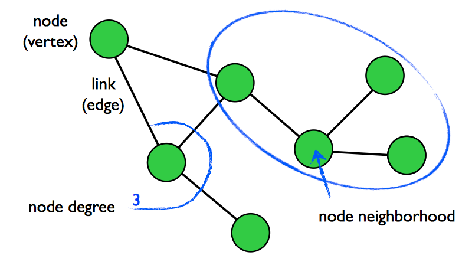
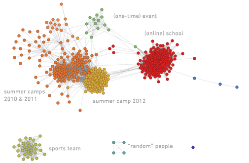
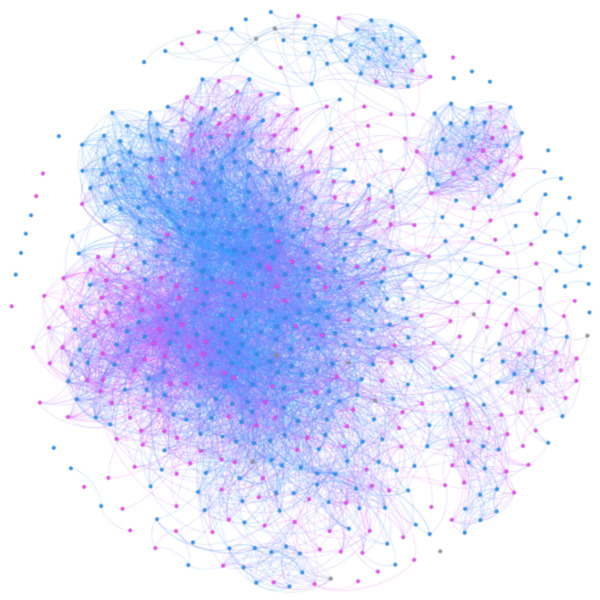
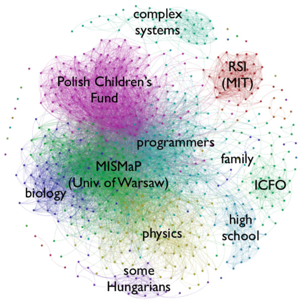
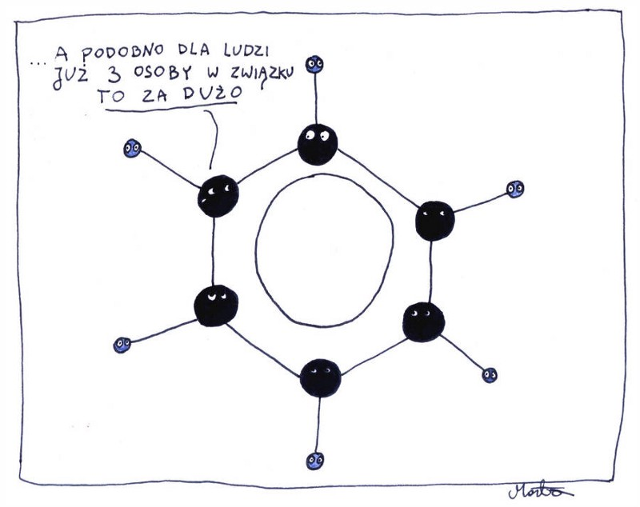
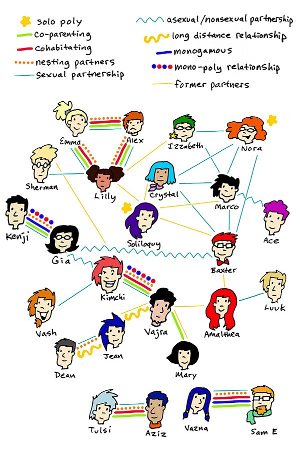
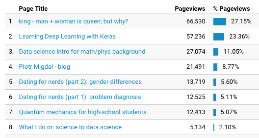

(CW: human sexuality, maths, LaTeX, spoilers for the Game of Thrones; based on a talk I gave with [Michał Kaftanowicz](https://kaftanowicz.com/))

Everyone chuckles and you are left out. And it is not the only xkcd strip on the intersection of sex and graph theory (some are even more niche, dedicated to heavy math users, e.g. [Hamiltonian](https://xkcd.com/230/)).

So, what is a graph (also known as a network)? In short, it is a collection of dots (representing entities) with some of them being connected by lines. Or, as [a diagram is worth a thousand equations](https://medium.com/inbrowserai/simple-diagrams-of-convoluted-neural-networks-39c097d2925b):

For a longer introduction, there is a [beautiful introduction to graph theory in D3.js](https://mrpandey.github.io/d3graphTheory/index.html).

OK, so how does it relate to social relationships? Well, we can turn to [the den of notworking, Facebook](http://phdcomics.com/comics/archive.php?comicid=877). Each node is a person, each link means that those people are Facebook friends. It excludes the main person, as they would be connected to everyone (giving no additional information, and a lot of clutter).

We can notice that nodes tend to cluster. Two people who have mutual friends are more likely to be friends. Maybe they have similar interests, or they met each other through the same groups and events. And here is mine:

Various things start during high school (OK, [for brainy kids they often start later](https://www.gnxp.com/blog/2007/04/intercourse-and-intelligence.php); discussed and hopefully remedied in my [Dating for Nerds](https://p.migdal.pl/blog/2017/07/dating-for-nerds/)).

Here is an opposite pattern — links are not clustered (in fact, they tend to avoid each other). The authors were surprised by the low number of cycles (lines in a circle). One may guess that a cultural trope of “don’t date your friend’s ex” plays a role (and other things related to jealousy and bad breakups).

In networking, we often talk about the six degrees of separation — i.e. that within 6 handshakes most people are connected to each other (though now it may be closer to [three and a half degrees of separation](https://research.fb.com/three-and-a-half-degrees-of-separation/) by Facebook). For the sake of STI safety, we can talk also about other… shakes.

Instead of relationships, we can look at acts. To get into juicy topics, let’s look at pop culture — The Game of Thrones:

Confused by a complex set of ties? So is [benzene](https://en.wikipedia.org/wiki/Benzene):

Yet, [polyamory](https://en.wikipedia.org/wiki/Polyamory) can be represented with a [multigraph](https://en.wikipedia.org/wiki/Multigraph) (pun totally indented):

Do you think it is complicated? At least all these relationships are symmetric. Which may be not the general case:

Lost? Well, not anymore, here is a (directed) (multi)graph:

### Homework

During the next party, draw a diagram of the participants. (Try ignoring questions whether you are high or drunk.)

Who is (or were) in a relationship? Any married couples? Or one-sided crushes? Are there any relatives? Colleagues? It is totally up to you what do you decide to include!

Alternatively, draw (if you are traditional) a family tree, or (if not so much) [non-monogamous relationship chart](https://www.reddit.com/r/polyamory/comments/2dmvx2/i_really_like_relationship_diagrams_lets_share/). If you are a mathematician (let’s make it clear: you aren’t here to learn about graphs), you [can draw your doctoral ancestors.](https://github.com/davidalber/geneagrapher)

Or, from your favorite game, movie or TV series. There is a lot of drama there. Hopefully much more drama than in your personal life.

### Links and references

For drawing diagrams, any tool is a good tool. It can be a pen & pencil, or the venerable MS Paint. Some other resources that may be useful:

- [Static and dynamic network visualization with R](http://kateto.net/network-visualization) by Katya Ognyanova (using [igraph](https://igraph.org/), which is also available for Python)
- [Graph drawing in TikZ](http://www.tcs.uni-luebeck.de/downloads/mitarbeiter/tantau/2012-gd-presentation.pdf) by Till Tantau (and why does LaTeX result in diagrams so much more beautiful than from GraphViz); see also [social diagrams on Overleaf](https://www.overleaf.com/read/srqwxhmxsxbd)
- [Gephi](https://gephi.org/) if you want something with a graphic user interface
- If you are really ambitious, D3.js offers the most flexible way to visualize interactive graphs, see [my list of learning materials](http://p.migdal.pl/2016/02/09/d3js-icm-kfnrd.html)

It used to be easy to download one’s graph of Facebook friends. Now it is much harder, and you need to resort to scraping, see: [Tutorial: Plotting your Facebook friend network using NetworkX and python-louvain](https://ndres.me/post/friend-graph-tutorial/) by Eliot Andres.

For a comprehensive, yet simple, introduction graphs for social networks I recommend a book [Network Science](http://networksciencebook.com/) by Albert-László Barabási, one of the key figures in complex systems. We just started with nodes & edges, and there is so much more interesting content.

If you are into the sociology of relationships —see [Sex by Numbers: What Statistics Can Tell Us About Sexual Behaviour](https://www.goodreads.com/book/show/25266687-sex-by-numbers) by David Spiegelhalter. While you won’t see many graphs (as networks; there are plenty of other charts), it does a stellar job of comparing statistics of various quality.

I have a soft spot for interactive graph viz in D3.js, see [my projects](http://p.migdal.pl/projects/):

- [TagOverflow](https://github.com/stared/tagoverflow) — An interactive map of tags from Stack Exchange sites
- [Graph-based word clouds](https://github.com/stared/nalogi-viz)
- [Tree of Reddit Sex Life](https://observablehq.com/@stared/tree-of-reddit-sex-life)

### Disclaimers, thanks, and adverts

All graphics belong to their creators. Do maths at your own risk.

While I know that sex does not sell, at least — not anymore (see: [Teenagers are better behaved and less hedonistic nowadays](https://www.economist.com/international/2018/01/10/teenagers-are-better-behaved-and-less-hedonistic-nowadays) — The Economist), I give it a try.

