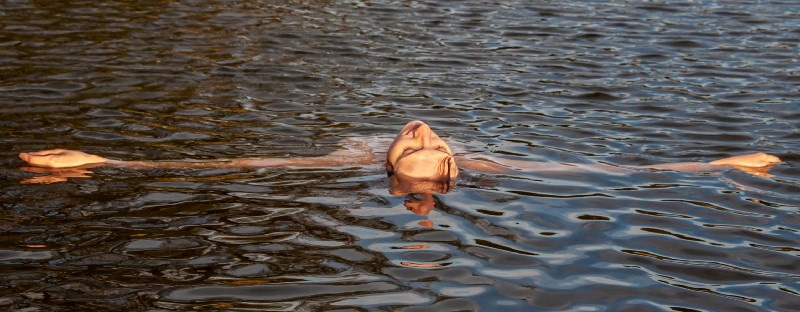
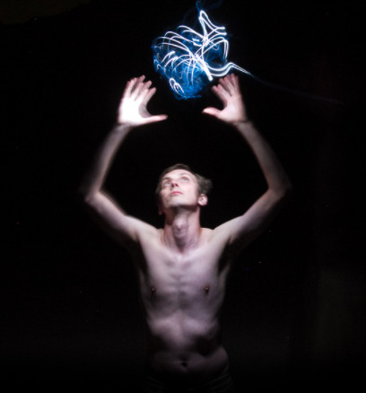
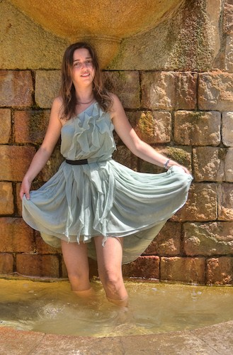
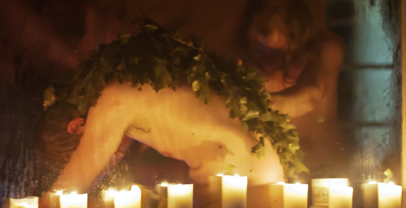
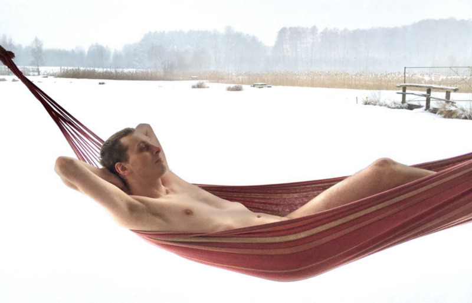

Or how you can learn to get in touch with your body and emotions.

During my first free improv workshop, I was asked what motivated me to participate.

> I don’t want to treat my body as a foreign tissue on my brain.

It was taken as a grim joke. Yet, it was an accurate description of my relationship with my body. I didn’t experience body dysphoria. I was reasonably healthy, and my body image was (and is) OK. In fact, I could decompose my body, piece by piece, and estimate which one is better or worse than the average.

But… my body felt as if it were something external. I felt like a ghost controlling a machine. My body was a prison, a life sentence of being bound to physical matter; an external shell containing me, rather than a part of me — as a driver perceives their car.

Earlier during my best days, I felt as a _“spirit hovering over the waters”_ from Genesis, pure thought and will. On gloomier days I felt like a lich — an undead sorcerer, who choose endless loneliness to pursue knowledge and power. Both of these were highly intellectual, and ghastly disembodied.

Now it is very much different. I didn’t need to give up anything from my cerebral site to connect with my body. Quite opposite — this connection allows experiencing the world more as if I gained new senses. Here’s what my process was (**My story**), with a few general pieces (**Lessons and takeaways**).

### My story

#### Before

I had been a stereotypical “cave nerd” — preferring to spend time indoors, playing and working on a computer, reading fantasy stories, and studying physics textbooks. I was clumsy in sports, especially team games involving balls (well, maybe with the exception of paintball). See my [Autistic traits, science and the nerd stereotype](https://crastina.se/autistic-traits-science-and-the-nerd-stereotype/).

It does not mean that I avoided all physical activities. I did a lot of walking and a bit of swimming, running, lake sailing, and rock climbing. But above all — I enjoyed mountain hiking. However, the experience was centered around fighting with oneself — resisting temporary discomfort to reach a peak. I looked down at idle activities such as sunbathing — as they neither provided a clear goal, nor a challenge, nor a dopamine kick.

#### The fountain

The first big moment came when I was walking in Barcelona with my friend and lover. She entered a fountain. I asked if she is not afraid of getting a fungal foot infection. She said that if she gets one, she will get treatment — but would rather risk a fungal infection than live a life without ever entering fountains.

I entered the fountain as well, immersing in the experience. For a moment I was living in “now”. And the ability to be in the present stayed with me forever.

It fits the chorus of [“Kiss the Night” by Various Manx](https://www.youtube.com/watch?v=Xby1imQDs3E&ab_channel=VariusManxTVVEVO) (translated from Polish by Staszek Krawczyk and me):

> Just for once, uncover your face  
> And stare right into the Sun  
> Get delighted, just delighted  
> And moved with all your heart  
> Don’t fear the fear, cry as needed  
> Go for a wild goose chase  
> Kiss the night in its highest star  
> Let it go… and dance

As I have an oversensitivity to light, this verse was particularly powerful.  
**There is no openness to experience without being vulnerable.**

#### Free improv

The next step was thanks to the Kotowski twins, my close friends. They were attending workshops that were an exploration of contact with body and emotions. I used to mock them that they were “opening their chakras”, looking down at a workshop that isn’t aimed at developing concrete skills. However, during one intense event, I heard from them:

> If it weren’t for free improv, I’d have gone crazy stuck inside my head.

It gave me a hint that the workshops were something more than a pleasant past-time. So, I signed up — and it turned out into one of the most transformative experiences. Free improv, in a nutshell, is a theatre:

- Without a script (you think: OK, I get it, improv theatre)
- Without words (you think: mime improv theatre?)
- Without an audience, including other participants or ourselves (you think: WHAT?)

It is hard to describe contact improv with words — but I will give it a try! If you’ve heard about contact improv, some variants of dynamic meditation, or intuitive dance — these are subsets of free improv. It has its roots in works by [Jerzy Grotowski](https://en.wikipedia.org/wiki/Jerzy_Grotowski); the core parts are:

- Being in the moment, spontaneous, in contact with your emotions.
- Not judging — others or oneself.
- Not having goals, plans, or expectations.
- Not trying to be or do things in a smart, beautiful, inspiring way — or other ways to impress others or oneself.

In particular, when you have a wonderful idea — drop it. If you want to reciprocate, drop it. For all perfectionists, strategists, masterminds, diplomats, and engineers — it might be hard. And at the same time: transformative. If it soaks in, it might be the most active ego-dissolutive state, short of psychedelics. Another description by Marcin Kotowski — [Free improv | Abandoned Depot](https://abandoneddepot.wordpress.com/2015/02/28/free-improv/), or a phrase from an unrelated song (“Postmodernism” by Jacek Kaczmarski, translated by Staszek & me):

> Don’t expect, don’t dream, don’t plan — take experiences as they come.   
>  Go beyond what’s good, what’s bad — it’s a play and only that.

At the end of the workshop, I asked how I can build a relationship with my body. I got a few homework exercises:

- Experiencing a lot of passionate sex.
- Touching surfaces with my back (touching with palms make a fine division between “me” and “the world”).
- Getting massages often.

I was slacking with the massage part for a long time. In other respects, I did my best to be a diligent student.

#### Things that followed

After the dam broke, the whole process went from a small leak to an enormous wave.

I participated in various events related to body and emotions. It included cuddle parties, kinky workshops, playfighting, [experience design camps](https://pmigdal.medium.com/cloak-dagger-creativity-camp-ce4a24aa6528), mindful ice bathing. Each was different — due to its form, leader, and participants. Each had a “technical part” directly related to the respective topic. Still, the best ones left a lasting, generalizable effect.

I started dancing. To some extent, dancing was much harder mentally than BDSM workshops. During the latter, it is expected that many people are new and feel awkward. There is a chasm between people how have been dancing to music since they were 3-year-old, and ones who haven’t before they turned 30. In dancing, a lot of people expect that you feel comfortable, in your body. For me, the connection between sounds and movement was as alien as relating letters to colors in synesthesia.

However, the Balfolk community of [Chata Numinosum in Warsaw](https://www.facebook.com/ChataNuminosum/) turned out to be particularly warm and inviting. There are always a few people dancing for the first time, joining a group from the spectrum of beginners to seasoned dancers. Balfolk is a modern version of dances from Brittanny, along with other regions of France and Europe in general. These are mostly danced in circles and chains, the setting is casual (usually t-shirts) and the focus is on moving together rather than a performance.

A much higher bar was for blues dance. It is very soft, cuddly & improvised, focused on non-verbal communication, and relaxed body. Not my main skills, so that’s what makes it an interesting challenge & exploration. However, during the first classes, it turned out that all participants (some visibly nerdy) worked in IT. It seems that I am not the only one going that route.

#### Now

And what’s now?

Well, I keep regularly dancing Balfolk, including a cuddly Mazurka. I started feeling good in my own, naked skin — not ashamed or stressed, but natural and immersed in sensations ([a post in Polish on my path there](https://www.facebook.com/piotr.migdal.9/posts/10165195985655360), happy to translate it there is a need; for context: in Poland, we are raised with antinudity mindset, unlike Germany or Czechia). I learn giving experiences in Russian banyas as a sauna master. Each ritual is different, mixes an overall plan with a lot of improvisation of stimulating senses of heat, cold, smell, touch, and sometimes — taste.

I try to massage and get a massage — mostly intuitively, using hands, peeling, or branches.

To my surprise, relaxing some parts of my body went way beyond affecting my body. Tension in the neck relates (in me) to a barrier between mind and body. Relaxing the neck brings a tingling sensation in the whole body, making it more open, more receptive, and less stressed. Relaxing the lower back (loin and sacrum; seriously no pun there) unites my sensual and sexual energies. Releasing this tension makes one open to touch and tactile sensations but without expectations or frustration.

### Lessons and takeaways

#### Nerds build castles from books as a means of self-protection

Why did I cripple my contact with body emotions in the first place?

I used to think that it relates to some kind of “intellectual superiority”, and being beyond animals and closer to angles, beyond the limitations of a matter-bound human body.

Now I see it was a defense mechanism. An escape into a safe space of the intellectual world, when the social one became unbearable. A higher ground to retreat and defend. A castle built of books, a safe haven behind a firewall. When the outer world is horrible, there is only one escape: the inner world. The world of thoughts, and dreams.

There are a lot of very smart people who have never had their asocial, disembodied phase. So I don’t think that it is all caused by “just being too smart”. There may be correlates (especially due to being different), but it’s not the root cause.

I realized that even the sense of grandiose (on many nerd fora there is a fetishization of knowledge and IQ) is an ego defense mechanism. Humiliated in other fields, it is a place to keep one’s self-worth and identity.

#### The mind-body dichotomy is a lie

In Western culture, we are soaked with Platonism and all its offshoots. One of them is Cartesian dualism — a belief in the separation of the material from the spirit world. This concept has its value in the history of philosophy. However, I side more with contemporary philosophers of mind such as Daniel Dennett — offering [a biological, evolutionistic perspective on consciousness](https://www.ted.com/talks/dan_dennett_the_illusion_of_consciousness?language=en). While still pretty reductionists, they offer a concept of “embodied cognition”, arguing that it is impossible to consider abstract intelligence, not related to the body or environment in which it operates.

A lot of nerds (especially under the umbrella of Rationalism or Less Wrong) have wet dreams about mind uploading, and other means to achieve immortality. I do as well. But it is good to admit that this “escape from one’s body” is a clear case of disembodiment.

Even the quest for immortality itself might be viewed as disembodiment. Death is a part of life, unless you are a hydra (a fresh-water polyp, not sure if it holds for the Greek beast). An escape from death, however tempting, might be an escape from life as well. This [theme has been covered in stories](https://tvtropes.org/pmwiki/pmwiki.php/Main/ImmortalitySeeker) — from Tithonus (immortal but aging and crippled beyond limits) to Ring Wraiths from “The Lord of the Rings”. In “Diablo” by Blizzard, there is a recurring theme of imprisoning a spirit in a body. Inspired by it, in 2015 I wrote:

> You travel into the East, together  
> Your soul and its prison moving along  
> Entering hell to break the shackles  
> But once soul’s free it’s shattered  
> For the constraints constitute its form

I never finished or shared the whole part, but another fragment of the same poem is in [Games in which you walk (and get immersed)](https://pmigdal.medium.com/games-in-which-you-walk-and-get-immersed-a80ad2bcfa7f).

#### Words imprison

Human languages compress the uniqueness and infinite details of an experience into rigid, culturally-defined, categories. They fail to express anything that is inherently subjective or deeply personal.

This is one of the reasons that no matter how much you read on connecting with the body, you cannot do it in place of immersing in experiences. I often catch myself that instead of experiencing experiences, I instinctively decompose and analyze them. While it occasionally gives valuable insight, it inadvertently reduces immersion.

Obviously, this blog post is as guilty as charged.

#### Soft contact with one’s body

I would like to give a distinction between two kinds of contact with one’s body: “a soft contact” (experiential, process-oriented) and a “hard contact” (instrumental, goal-oriented).

“Soft contact” is not only about feeling or soothing one’s body. It is about making body sensations a part of one’s life experience, rather than a tool. It is even not a synonym for light and pleasant experiences. If you **experience** (but don’t resist) pain, discomfort, tiredness — it is still “soft contact”.

Dancing can be on any part of the spectrum, depending on whether you focus on the correct form or the experience of the movement itself. To some extent, it is a function of what you do, but mostly — on your attitude.

While having prior sports experience is usually a plus when it comes to the mind-body relationship, one can have as much “hard contact” as possible without a trace of “soft contact”. For example, if it is about resisting pain, discomfort, tiredness (in cardio workouts, running marathons, swimming, mountain hiking, dancing ballet, yoga, receiving massages) — it is all ”hard contact”.

#### A shell protects against all experiences — bad and good alike

It is impossible to have a shield against all negativity while being open to positive experiences. A shell works both ways. Protects and imprisons. Reduces absorption of both damage and nutrients.

For example — cynicism is a way to protect yourself against a lot. If you do it really well, you can easily dismiss all suffering humankind experiences, and all cruelty it delivers. However, the same mindset is a failsafe method to miss all good deeds, intentions, all acts of vulnerability or kindness. All of them are considered naive, dumb, with yet-to-be-discovered ulterior motives, or irrelevant in the sea of human misfortune.

Most of these protection mechanics can be classified as fight, flight, and freeze responses to fear.

- The emotional freeze is numbness, which when left to itself can collapse into depression.
- The emotional flight is a number of dismissive approaches — distancing oneself with humor or escaping into cold rationalism.
- The emotional fight is all struggle and frustration that the world is not as it ought to be.

I cover it in [Don’t fight, flight (or freeze) your body and emotions](https://pmigdal.medium.com/dont-fight-flight-or-freeze-your-body-and-emotions-96f5aa30b299) — exploring seemingly unrelated phenomena such as procrastination, avoidant attachment style, and depression. It is a Hacker News-recognized piece, so it has to be good, right? :).

Why expose yourself if you may get hurt? Or actually — if you know that sooner or later you WILL get hurt? The answer is simple: so as to not miss out on all the good things in life.

There is a silver lining: when in this “soft state”, some things hit, but surprisingly hurt much less. As it is a reactive state — much like a jelly. And if there is a cut, it regenerates well, without leaving scars. In contrast, a hard shell withstands a lot, but once it’s too much, it shatters into pieces.

#### Male socialization takes its toll

In Western cultures, a lot of forms of soft contact are shunned down (even if not forbidden). Even handshakes and hugs between men are expected to be short and firm. Everything more delicate, sensual, or intimate is expected to be reserved for romantic and erotic activities.

Even in sex, a lot of focus is on performance rather than experience.

My ex-partner Sarah Martin put emphasis on using “experience orgasm” in the place of “achieve orgasm”. It is not about a pedantic choice of terms. It is about the focus — is it about the process or an accomplishment?

Her Master’s thesis was on “market metaphors in Pick-Up Artists handbooks”. One of her biggest surprises was that among people who aim at getting laid a lot there is almost no discussion about experiencing sex. Not even from a male pleasure perspective. Her remark was “do they even enjoy sex?”.

Her advice is to read these few authors that actually love sex and love women (e.g. Mark Manson and Richard la Ruina); see also [Pickup Artists: What You Need to Know](https://medium.com/sex-coach-u-magazine/pickup-artists-what-you-need-to-know-3f95d3a54d3) by [Sarah Martin, MA, CSC](https://medium.com/u/39462454f46a). My remarks (including on toxic masculinity) are covered in the [Dating for Nerds series](https://p.migdal.pl/2017/09/30/dating-for-nerds-gender-differences.html).

For women, there is somewhat more social permission for friendly hugs or body-related self-care (visiting SPAs, cliche photos of baths with rose petals, etc). From my anecdata, significantly fewer women are disembodied. Though, many have a negative relationship with their body, mostly due to an (actual or perceived) mismatch with societal expectations.

#### You don’t need to give up your nerd card

Contact with your body is arational — neither rational nor irrational. Some non-intellectual people do sports, some others use pseudoscientific theories for connecting with their emotions and body. It does not mean that connecting with your body is inherently stupid or irrational.

(Over the years I got less sharp when it comes to religion, new age-y stuff, etc. If it helps someone and does not hurt others, why not? I treat these kinds of spirituality as poetry — even if on the literal level it is not true, it can still have immense value — motivational, aesthetic, meditative, etc.)

While in the 60s and 70s there was a strong divide between scientific rationalism and spirituality, now the gap gets bridged e.g. by [Sam Harris](https://www.youtube.com/watch?v=HlJqez0pqhE) and [William Richards in “Sacred Knowledge”](https://www.goodreads.com/review/show/4205670187).

You can [dance Balfolk to Mario and Star Wars](https://www.youtube.com/watch?v=bloJC33pB1w). You saw the T-Rex photo.  
I often do sauna rituals with nerdy music — including the stunningly beautiful [Ori and the Blind Forest](https://www.youtube.com/watch?v=MeVFrt7BUyw) soundtrack, Malukah singing [“Priscilla’s Song” from The Witcher](https://www.youtube.com/watch?v=eOR2QYy670k).

#### It is fine to start from the beginning

What if your dancing skills are below an average 3-year-old? It does not matter. Once you drop the performance/competition mindset, you can learn (and enjoy) things regardless of your objective competence.

Yes, it will be leaving your comfort zone. But it is fine. For once, let yourself be “the worst” and still enjoy that! Enjoyment obtained from being the best (or striving at doing so), or relating to others’ performance, is NOT about the experience. It’s about judgment (perfectionism is judgment).

But you don’t need to be hard on yourself. All in all — you can treat this growth as a process and experience, not something goal-oriented.

### Conclusion

If you’ve made a similar path — I am happy for you.

If you want to grow that way — I hope I gave a bit of inspiration.

#### Acknowledgments

Many people helped me on this path, with a special thanks to Marcin & Michał Kotowski, Anna “Melisandre”, Rysiek, Sarah, Seani, Seth, Sofi, Stefan, and the Ojrzanów/Parostacja team.

This text benefited from discussions with [Meggy Pepelanova](https://twitter.com/pepelanova), [Marcin Kotowski](https://www.math.toronto.edu/~marcin/), and [Sarah Martin](https://medium.com/@SexCoachSarah).
